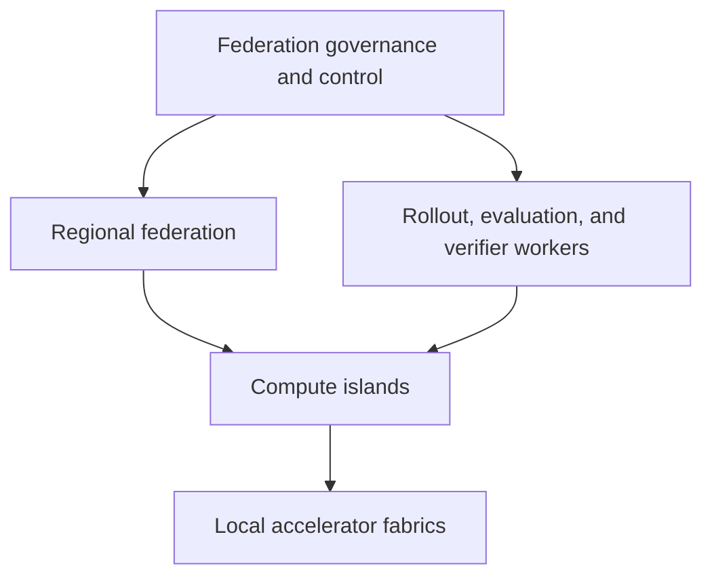

# Federated Frontier Intelligence

Federated training, reinforcement learning, inference, verification, and governance for open frontier-scale AI.

Federated Frontier Intelligence (FFI) is a research and engineering program asking whether globally distributed, heterogeneous, independently operated compute can produce and continuously improve frontier-capable AI. It treats federation as a whole-system problem spanning compute, data, models, optimization, reinforcement learning, inference, verification, security, economics, and governance.

## Current conclusion

**Technically feasible at intermediate scales; scientifically interesting and immature at frontier scale.**

The strongest public evidence includes globally distributed pretraining of a 10B dense model on one trillion tokens, globally decentralized RL of a 32B model, and large-scale RL post-training of a 106B-total/12B-active MoE. DiLoCo-family research now reaches 10B experiments with more than 100-fold communication reduction, and Decoupled DiLoCo supplies a credible asynchronous research direction. Public evidence through August 20, 2026 still leaves frontier-scale heterogeneous-WAN pretraining, adversarial update integrity, and hierarchical WAN-aware sparse routing unproven.

| Status | Meaning here | Examples |
|---|---|---|
| **Demonstrated** | Reproduced or operated at a stated scale | 10B WAN pretraining; 32B decentralized RL; WAN collective prototypes |
| **Planned** | Required and traceable, awaiting an experiment | Two-island emulator; 100M–1B optimizer comparison; fault injection |
| **Hypothesized** | Falsifiable claim rather than architecture fact | Hierarchical sparse federation; permissionless verified training updates |

## Central hypothesis

Frontier-scale intelligence may be assembled from a hierarchy of locally high-bandwidth compute islands linked by low-frequency, compressed, and eventually asynchronous synchronization. A much larger loose federation can perform inference-heavy work: rollouts, synthetic-data generation, evaluation, verification, search, and environment interaction.

Fast collectives stay within an island. Coarser model deltas, checkpoint fragments, verified trajectories, and evidence cross slower links. Token-level expert routing across the public Internet remains an experiment, rather than a baseline.

## How this differs from ordinary federated learning

Conventional federated learning usually coordinates many data-owning clients around a server and a relatively small model. FFI studies a hierarchy of training islands, distributed optimization, sparse and modular architectures, asynchronous RL, federated serving, machine-verifiable work, frontier security, resource economics, and shared ownership. Data locality is one design dimension among ten.

## Research tracks

- **Track A — Frontier-adjacent model:** start from a strong open-weight base and use the federation for verified data, rollouts, evaluation, SFT, RL, merging, and specialization.
- **Track B — Federation research model:** train from scratch through empirical stages: 100M, 500M–1B, 3B, 7B, 20–40B, 100B+ sparse, and only then a frontier attempt.

Every scale transition is earned by quality, communication, recovery, provenance, security, and cost evidence. A small run that falsifies an architectural assumption has greater research value than an expensive run that hides it.

## Start here

- [Research status](docs/research/state-of-the-art.md)
- [Evidence matrix](docs/research/evidence-matrix.md)
- [Architecture overview](docs/architecture/overview.md)
- [Candidate decision matrix](docs/architecture/candidate-architectures.md)
- [Requirements](docs/requirements/system-requirements.md)
- [First experiment](docs/experiments/experiment-0001.md)
- [Contradictions](docs/research/contradictions.md)
- [Roadmap and gates](docs/roadmap/frontier-scaling-roadmap.md)
- [Contribution guide](CONTRIBUTING.md)

## Project status

The repository currently contains a research-grounded specification corpus and an experimental plan. It contains no training implementation and makes no claim of having produced a frontier model. Architecture decisions with limited evidence remain **Proposed** or **Experimental** in [the ADR register](docs/adr/README.md).

## Governing principle

> Models propose; programs verify; the federation aggregates.

The project couples that technical rule to an institutional one: distributed production requires distributed, enforceable decision rights. Compute federation paired with concentrated ownership would reproduce the social relation the project intends to transform.

## License

Repository software and documentation are currently licensed under the existing [MIT License](LICENSE). Model weights, datasets, and contributed artifacts require separate, explicit licenses and contribution terms before publication; see [licensing options](docs/governance/licensing.md).

## Citation date

The research baseline is current through **August 20, 2026**. Claims carry an evidence class from E0 (speculative) through E4 (frontier-demonstrated).
