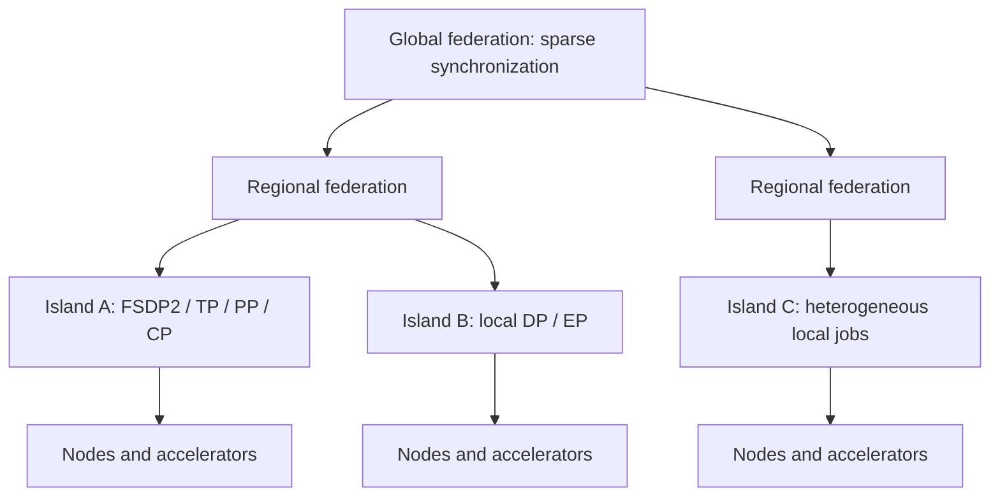

# Compute-island architecture

A compute island is the largest failure domain in which synchronous collectives have predictably high bandwidth and low latency. It may be one workstation, one rack, or one cluster; administrative ownership alone does not define it.

## Island contract

An island advertises measured memory, supported dtypes and kernels, collective bandwidth/latency, storage locality, network egress, reliability history, software measurement, and policy constraints. It exposes job-level capacity rather than individual unmediated GPUs.

Training work is packaged as an immutable job specification. The island fetches signed inputs, validates hashes, trains for a token budget or local-step lease, emits a delta/checkpoint plus lineage and telemetry, and deletes or retains sensitive material according to policy.

## Parallelism placement

| Mechanism | Default boundary | Reason |
|---|---|---|
| Tensor, context, expert parallelism | Node or tightly coupled fabric | Communication occurs inside layers or tokens |
| Pipeline parallelism | Local island | Bubble and activation traffic are latency-sensitive |
| FSDP2/data parallelism | Local island, sometimes region | Regular collective volume needs reliable bandwidth |
| Local SGD/DiLoCo outer loop | Island-to-island | Trades synchronization frequency for local compute |
| Task/sequence routing | Region/global | One WAN decision can amortize many tokens |
| Token expert routing | Local island only | WAN latency otherwise enters every routed layer |

## Heterogeneity

Homogeneous worker groups run coupled kernels. Slower or memory-constrained devices receive different batch sizes, context classes, modules, evaluation, or rollout tasks. The scheduler must not force a 32 GB consumer GPU into a collective dominated by an H200 unless profiling proves the group efficient.

Fault containment stops at the island boundary: local optimizer-state loss may restart one island; no island may corrupt the last signed global checkpoint.
