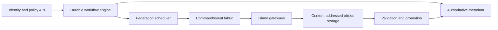

# Federation control plane

## Responsibilities

The control plane owns identity and trust, capability inventory, admission policy, durable workflows, scheduling, artifact/checkpoint registries, experiment tracking, verification decisions, contribution accounting, audit, revocation, and governance records. It does not proxy bulk tensors or trajectories.

## Technology evaluation

Requirements currently favor PostgreSQL for relational authority and transactions, S3-compatible object storage for immutable bulk artifacts, a durable workflow system such as Temporal for long-lived retries, and NATS JetStream or Redpanda for bounded event distribution. This is a proposed reference stack, not an accepted product selection. Kafka/Redpanda is stronger for high-volume retained streams; NATS is simpler for control messages. A benchmark should decide.

Kubernetes, Slurm, Ray, SkyPilot, or Nomad remain island-local adapters. No one substrate is expected to span all owners. Federation scheduling is a policy layer above those systems. SPIFFE/SPIRE is the leading workload-identity candidate; OpenTelemetry, Prometheus-compatible metrics, and Grafana are observability candidates.

## Consistency

Identity, policy, lease, artifact-state, and promotion writes require transactional authority. Telemetry may be eventually consistent. Leases have explicit epoch, expiry, retry, and idempotency semantics. Regional schedulers may continue already-authorized work during partition but cannot promote a new global checkpoint.

The metadata database is reconstructable from backups plus audit/event records. Object storage keeps hash-addressed immutable bytes; mutable aliases such as `current` resolve through signed registry records.
