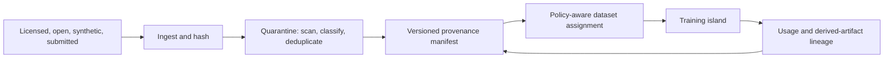
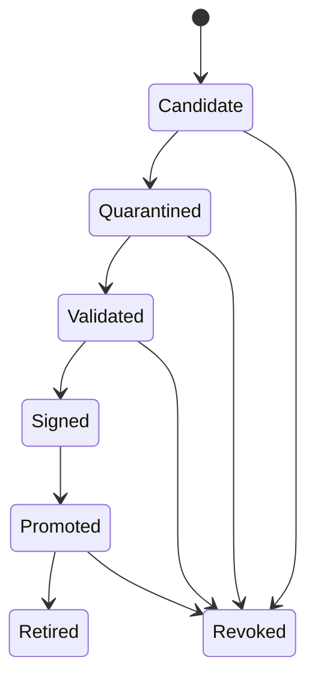

# Data and artifact plane

The data plane moves immutable datasets, model shards, deltas, trajectories, evaluation outputs, manifests, and verification evidence. Control messages carry references and authorization, not bulk payloads.

## Training data flow

Every transfer is resumable, integrity checked, encrypted, and policy authorized. Regional caches reduce repeated WAN movement. Data manifests can reference partitioned content without granting the control plane raw access.

## Checkpoint lifecycle

Promotion binds tensor hashes, architecture/tokenizer, parent(s), training/merge method, optimizer-state policy, evaluation report, signatures, and release class. Garbage collection follows retention and legal obligations; hashes and tombstone/revocation history remain auditable where lawful.

## Transport

HTTPS/QUIC multipart object transfer is the portable baseline. RDMA/NCCL/PCCL-like transports may be used within trusted compatible fabrics but must not become the federation API. Transfer metrics include logical/transmitted bytes, compression, retries, cache hits, egress cost, and integrity failures.
