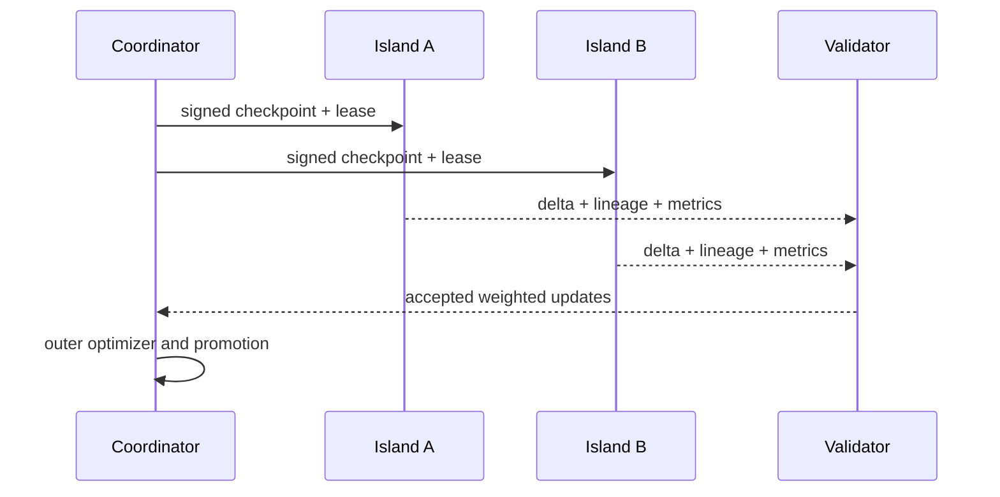

# Distributed optimization

## Quantitative model

Let `P` be synchronized parameters, `q` bytes per communicated value, `N` islands, `H` local steps, and `b` trained tokens per island-step. A ring-style exchange has approximate federation traffic per outer synchronization:

\[
B_{sync} \approx 2(N-1)Pq
\]

and network-wide bytes per trained token:

\[
B_{token} \approx \frac{2(N-1)Pq}{H b N}.
\]

Compression changes `q`; fragmentation changes peak memory and overlap; topology changes the constant. Report both transmitted and logical bytes. A more honest efficiency measure is:

\[
\eta = \frac{T_{compute}}{T_{compute}+T_{communication}+T_{idle}+T_{recovery}+T_{verification}}.
\]

## Baseline algorithm

Each island starts from signed outer checkpoint `θ_t`, runs an inner optimizer for a specified token budget, and returns pseudo-gradient `Δ_i = θ_t - θ_i` with sample/token weight. The outer optimizer validates, clips or rejects, aggregates, applies momentum, and emits `θ_(t+1)`. All weights, freshness, exclusions, and optimizer states are versioned.

## Variants under test

- Conventional DDP: high-quality/local-network reference.
- Local SGD: periodic average without learned outer optimizer.
- DiLoCo: inner AdamW and outer Nesterov-style optimization, varying `H` and precision.
- Decoupled/streaming style: fragments, minimum quorum, grace window, and token weighting without a global barrier.
- Branch-train-merge: independently trained checkpoints merged only under compatibility checks.

## Safety invariants

Updates never directly mutate a promoted checkpoint. Aggregation enforces parent lineage, staleness bounds, per-identity quotas, numerical sanity, norm bounds, evaluation quarantine, and rollback. Robust means are not a proof of honest computation. Full optimizer-state reconciliation after divergent branches is an open problem and must be measured rather than inferred.
