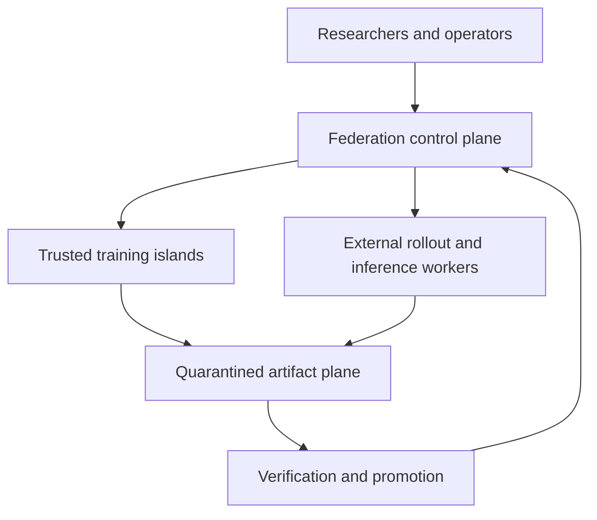
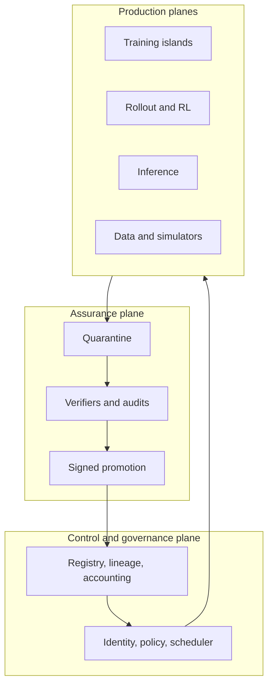

# Architecture overview

Status: Proposed, with the initial experimental baseline Accepted. Evidence level: E2 for intermediate-scale low-communication training; E0–E1 for the complete frontier federation.

## Context

The federation is not conventional federated learning. It coordinates model optimization, data and trajectory production, inference, verification, economics, and governance across independently operated failure and trust domains.

## Current recommendation

Use a **hierarchical hybrid**:

1. Within an island, use conventional high-bandwidth PyTorch techniques: FSDP2, tensor/pipeline/context parallelism, local data parallelism, and local expert parallelism where justified.
2. Across islands, begin with dense-model Local SGD and DiLoCo-family delta exchange. Evaluate asynchronous, token-weighted, quorum-based outer optimization as an experimental extension.
3. Keep token-level MoE routing inside a low-latency island. Global routing selects an island/path per task or sequence; WAN token routing is prohibited in production unless an experiment overturns the latency model.
4. Separate training from inference-heavy rollout, evaluation, search, and machine-verifiable environments. Less-trusted workers contribute only discardable, checkable artifacts.
5. Promote artifacts through quarantine, independent validation, signing, and an auditable decision.
6. Operate two tracks: post-train a strong open-weight model for useful frontier-adjacent work; train a research model from scratch through scale gates.

## Logical architecture

## Decision posture

The full system is not claimed to exist. PostgreSQL/object storage/workflow orchestration, sparse federation, proof systems, and incentive design remain alternatives pending measured requirements or explicit ADR acceptance. See [candidate architectures](candidate-architectures.md) and [ADRs](../adr/README.md).
