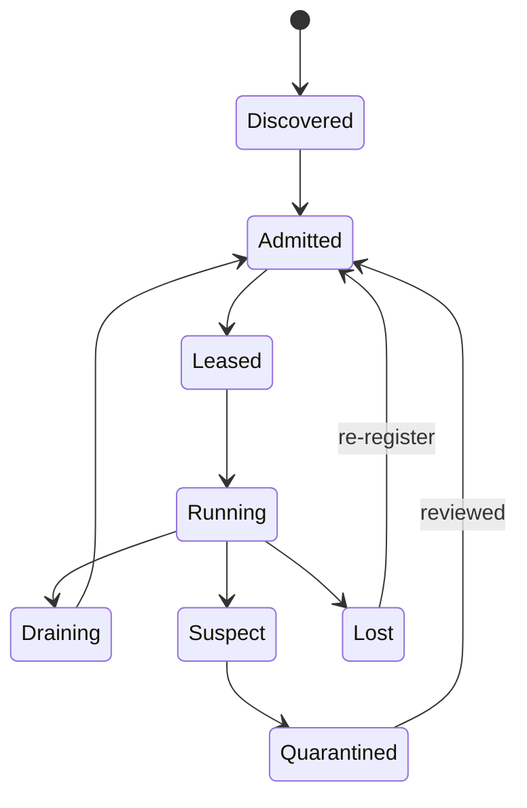
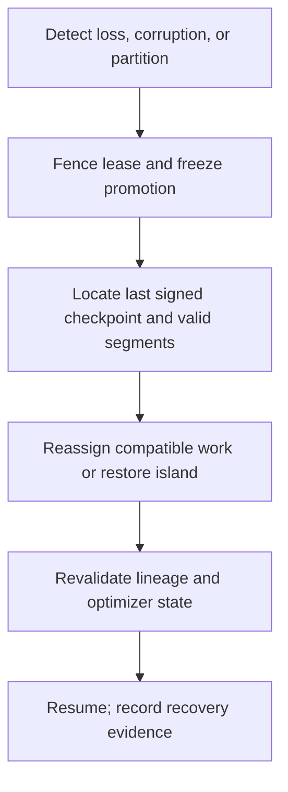

# Reliability and elastic operation

## Worker lifecycle

Leases, not permanent membership, define work ownership. Heartbeats only indicate liveness; progress is derived from signed checkpoints/segments. Stragglers may finish inside a grace window, be discounted by staleness, or have work reassigned with an idempotency key.

## Failure and recovery

Fault-containment boundaries are process, accelerator/node, island, region, control-plane service, and artifact store. A regional partition may continue an already leased local inner loop but cannot issue new global promotions. Conflicting branches remain candidates, not competing `current` pointers.

## Recovery policy

Checkpoint cadence minimizes expected recomputation plus transfer/storage overhead and is tuned per failure distribution. Full checkpoints are supplemented by deltas only when restore chains remain bounded and verified. Optimizer state is first-class; losing it is not equivalent to weight-only continuation. Cross-region copies protect the last promoted checkpoint and metadata backups. Disaster drills cover key loss, object corruption, database restore, malicious promotion, region loss, and rollback.
