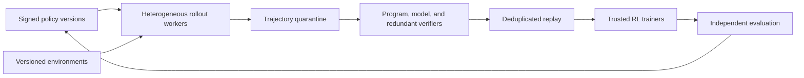

# Federated reinforcement-learning plane

RL is decomposed into policy trainers, rollout workers, environment workers, verifiers, reward services, evaluators, replay/trajectory storage, and model distribution.

## Trajectory contract

Each trajectory binds policy and tokenizer version, sampling settings, prompts/environment state references, episode ID and seed, tool calls, rewards, verifier certificates, timestamps, hardware/software identity, and content hash. Restricted prompts never leave eligible tiers.

## Asynchrony

The trainer records policy lag in tokens and versions. It rejects beyond a configured staleness window or applies an explicitly tested off-policy correction. GRPO/PPO-family choices are experiment variables. Large queues are not free throughput: stale trajectories can bias learning, reward systems drift, and long episodes amplify version lag.

## Permissionless boundary

Tier 4 is useful where results are machine-checkable, redundantly scored, or cheap to discard: code tests, formal proof, deterministic simulation, search candidates, public evaluation, and low-risk inference. Tier 4 does not train authoritative weights. Canary work, deduplication, rate limits, hidden tests, cross-worker replication, and delayed payment reduce fabrication but do not eliminate collusion.

Rollout contribution is counted only after verification and quality attribution. A raw token or GPU-hour is not useful intelligence.
