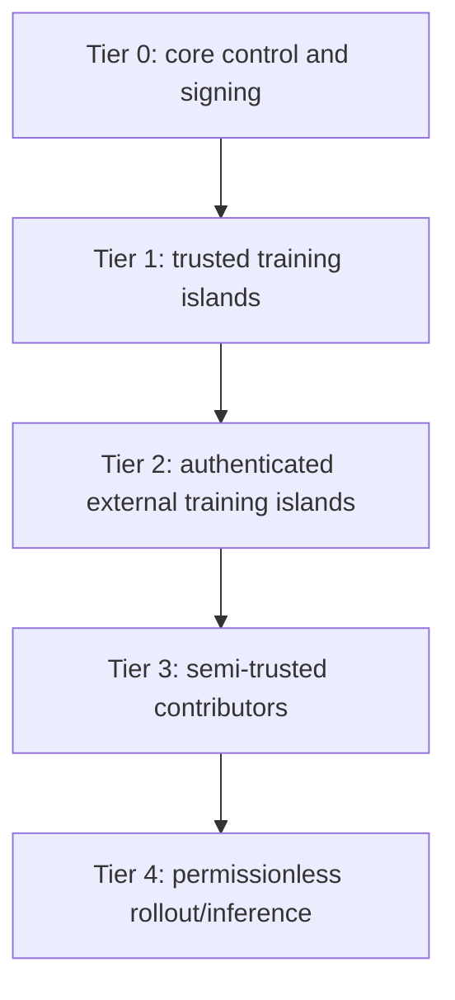

# Trust and identity architecture

Identity answers *who or what signed this*; attestation answers *what measured stack started*; reputation summarizes past observations; verification evaluates a specific artifact. These signals remain separate.

| Tier | Permitted work | Permitted assets | Required controls |
|---|---|---|---|
| 0 | policy, promotion, keys, registry | all as role requires | hardware-backed keys, separation of duties, audit |
| 1 | authoritative training and aggregation | approved weights, optimizer state, governed data | managed stack, strong identity, monitoring |
| 2 | bounded training branches | scoped checkpoint/data shards | authenticated operator, quarantine, replication/audit |
| 3 | evaluation, public-data synthesis, candidate modules | public or scoped artifacts | rate limits, hidden tests, no direct promotion |
| 4 | public inference, rollout, search, verifiable environments | public/restricted-release model only | discardability, canaries, redundancy, no secrets |

Capabilities are least-privilege, short-lived, workload-bound, and policy evaluated. SPIFFE-compatible workload identities and signed workload manifests are candidates; human and organization identity requires separate governance and recovery.

Tier changes are explicit decisions with evidence. Reputation cannot automatically elevate access to restricted weights. Sybil resistance may use organizational verification, scarce admission, workload quotas, or bonds only where a non-token economic analysis supports them; blockchain is not an assumed requirement.
