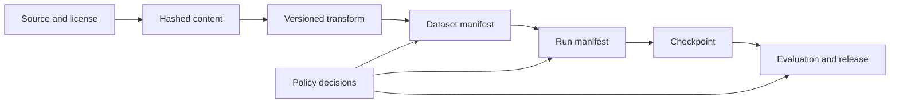

# Training provenance graph

## Core entities

`Source → Capture → Content → Transformation → DatasetVersion → MixtureAssignment → TrainingRun → Checkpoint → Evaluation/Release`.

Each edge records actor/workload identity, software and parameters, time, policy decision, inputs, outputs, and signatures. Many-to-many derivation is explicit: one deletion or license change can query affected token shards, runs, checkpoints, and releases without claiming that weight-level unlearning is solved.

## Minimum manifest

Fields include schema version, artifact ID/hash/size/media type, parents, source URI and retrieval date, rightsholder/license basis, contributor, collection jurisdiction/date, transforms and software digests, model-generated flag and generator lineage, quality and safety assessments, PII/sensitive classification, benchmark-contamination evidence, eligibility rules, retention/deletion terms, usage events, signatures, and exceptions.

Synthetic chains record the generating model and its known training lineage to measure recursive contamination. Generated data is not “license free” by default.

FFI-DATA-002: training jobs **MUST** bind an immutable mixture manifest and record exactly which shards were actually consumed, including resume and rejection behavior. Verification: replay manifest against logs and counters. Status: Proposed.

FFI-DATA-003: policy changes **MUST** support forward exclusion and an impact query over descendant artifacts; any claim of deletion from weights requires a separate validated method. Status: Proposed.
