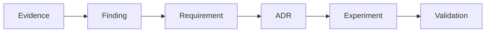

# Documentation map

| Need | Start here |
|---|---|
| Understand the thesis | `vision/mission.md`, `research/state-of-the-art.md` |
| Evaluate the evidence | `research/evidence-matrix.md`, `research/bibliography.md` |
| Review architecture | `architecture/overview.md`, `architecture/candidate-architectures.md` |
| Implement a component | `requirements/`, accepted ADRs, `exec-plans/active/` |
| Inspect normative domain rules | `requirements/domain-requirements.md` |
| Run an experiment | `experiments/methodology.md`, `experiments/experiment-0001.md` |
| Review security | `security/threat-model.md`, `architecture/trust-and-identity.md` |
| Review governance | `governance/`, root `GOVERNANCE.md` |
| Inspect scaling logic | `economics/cost-model.md`, `experiments/scaling-gates.md` |

The repository’s traceability chain is:

